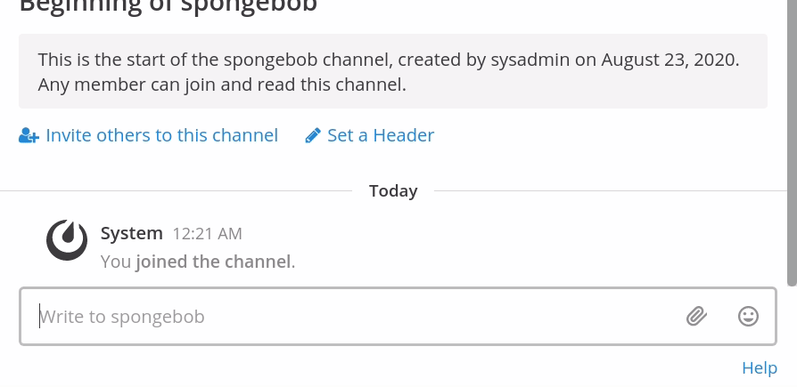

# MoCkInG SpOnGeBoB MeMe tExT PlugIn

This Mattermost plugin transforms text into text inspired by the [Mocking Spongebob meme](https://knowyourmeme.com/memes/mocking-spongebob) to allow you to properly ridicule your enemies and torment your friends on Mattermost.

It assumes that you have a custom emoji `:spongebob:` with an image of the meme. This is not provided. In the future, this may be configurable.

(it was me; I thought it was a good idea)
